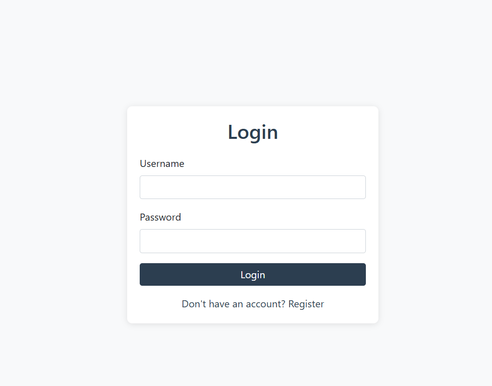
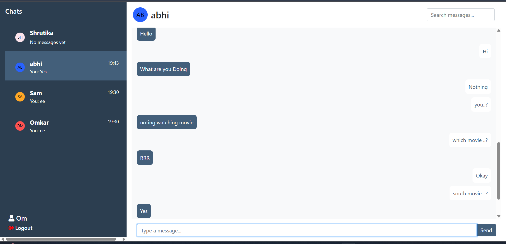
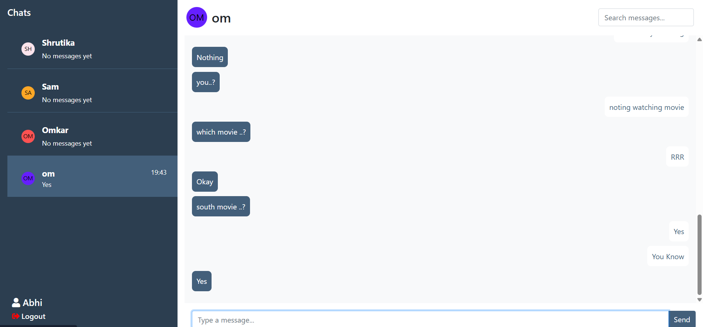
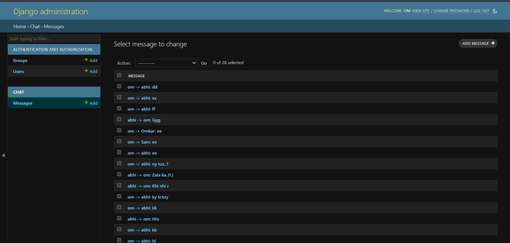
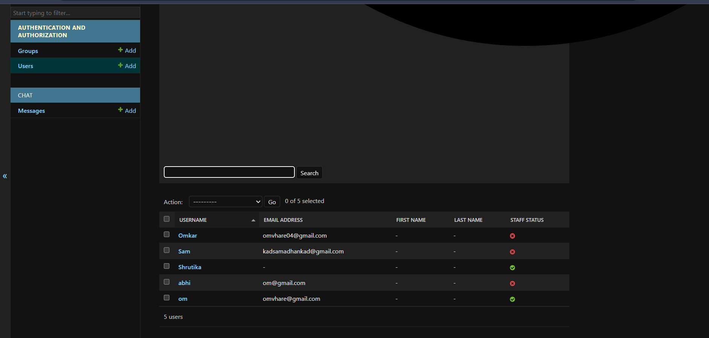

# 💬 Django Chat Application

A basic real-time chat application built using Django. It supports user registration, login, and a simple message-based chat interface with an admin panel for user/message management.

---

## 🚀 Features

- 👤 User Account Creation
- 🔐 User and Admin Login
- 💬 Real-time Chat Interface
- 📂 Chat Rooms (e.g., chat1)
- 📨 Message Viewing and Sending
- 👥 User List View (Admin/General)
- 🔒 Authentication & Session Handling

---

## 🛠 Tech Stack

- **Backend:** Django (Python)
- **Database:** PostgreSQL or SQLite
- **Frontend:** HTML, CSS, Bootstrap
- **Deployment Ready:** Git & GitHub, Render, Azure, or AWS

---

## 🖼️ Screenshots


### 🔹 Login Page


### 🔹 Account Creation


### 🔹 Admin Login


### 🔹 Chat Interface


### 🔹 Chat Room 1


### 🔹 Messages


### 🔹 Users List


---

## 📁 Setup Instructions

```bash
git clone https://github.com/YourUsername/YourRepoName.git
cd YourRepoName
python -m venv env
source env/bin/activate  # For Windows: env\Scripts\activate
pip install -r requirements.txt
python manage.py migrate
python manage.py runserver
